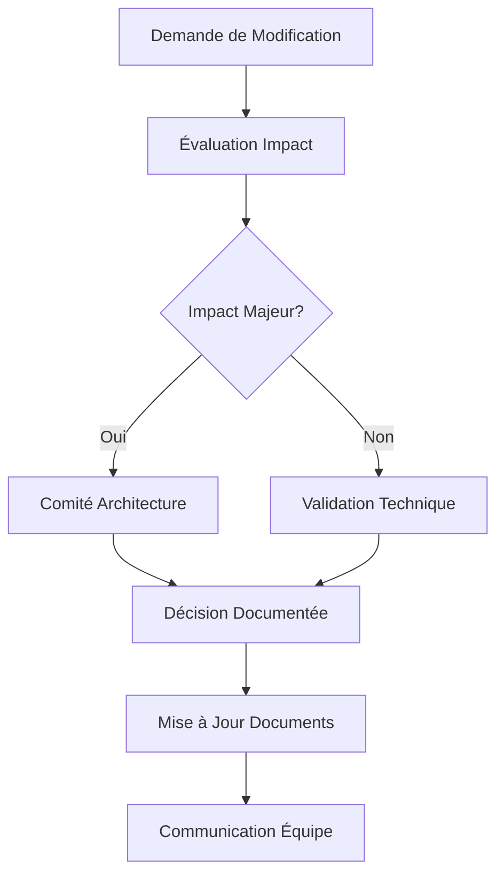

# Plan d'Action Global - AI Log Analyst

## 📋 Vue d'Ensemble

Ce document constitue le **guide maître** pour l'implémentation du projet AI Log Analyst. Il définit les processus, règles et mécanismes de contrôle pour garantir la cohérence, la qualité et le respect des exigences tout au long du développement.

### 🎯 Objectifs du Plan
- Maintenir la cohérence avec l'architecture globale
- Garantir le respect des exigences fonctionnelles et techniques
- Faciliter le suivi de l'avancement
- Permettre une validation systématique à chaque milestone
- Assurer la qualité et la maintenabilité du code

---

## 1. 🔍 Éléments à Vérifier à Chaque Étape

### 1.1 Vérifications Pré-Implémentation

#### **Avant de Commencer une Tâche**
- [ ] **Contexte** : Lire le PRD, l'architecture et le plan de sprint concerné
- [ ] **Dépendances** : Vérifier que les prérequis sont satisfaits
- [ ] **Environnement** : S'assurer que l'environnement de développement est configuré
- [ ] **Branches** : Créer une branche feature dédiée (`feature/sprint-X-task-name`)
- [ ] **Tests** : Identifier les tests à implémenter (unitaires, intégration, e2e)

#### **Pendant l'Implémentation**
- [ ] **Standards** : Respecter les conventions de code Python (PEP 8, type hints)
- [ ] **Architecture** : Suivre les patterns définis (Factory, Observer, Strategy)
- [ ] **Logging** : Implémenter le logging structuré avec les niveaux appropriés
- [ ] **Gestion d'erreurs** : Gérer les exceptions avec des messages explicites
- [ ] **Performance** : Considérer l'impact performance (async/await, caching)

#### **Après l'Implémentation**
- [ ] **Tests** : Couverture ≥ 85%, tous les tests passent
- [ ] **Documentation** : Docstrings, README mis à jour si nécessaire
- [ ] **Code Review** : Auto-review avant soumission
- [ ] **Intégration** : Tests d'intégration avec les autres modules
- [ ] **Validation** : Critères d'acceptation respectés

### 1.2 Vérifications par Type de Composant

#### **Modules Core (Parsing, Detection)**
```yaml
Checklist:
  - Configuration YAML valide et documentée
  - Gestion des formats de logs multiples
  - Patterns d'erreurs configurables
  - Métriques de performance exposées
  - Tests avec données réelles anonymisées
```

#### **Agents IA**
```yaml
Checklist:
  - Prompts versionnés et testés
  - Gestion des timeouts et retry
  - Validation des réponses IA
  - Fallback en cas d'échec
  - Métriques de qualité des réponses
```

#### **Interface Utilisateur**
```yaml
Checklist:
  - Responsive design (mobile, desktop)
  - Accessibilité (WCAG 2.1 AA)
  - Performance (< 3s chargement initial)
  - Tests utilisateur (Selenium)
  - Gestion des états d'erreur
```

#### **Base de Données / Qdrant**
```yaml
Checklist:
  - Schémas de données validés
  - Index optimisés
  - Sauvegarde/restauration testée
  - Monitoring des performances
  - Sécurité des accès
```

---

## 2. 📏 Règles et Bonnes Pratiques

### 2.1 Standards de Développement

#### **Architecture et Design**
```python
# ✅ Bon : Injection de dépendances
class LogProcessor:
    def __init__(self, parser: LogParser, detector: ErrorDetector):
        self.parser = parser
        self.detector = detector

# ❌ Mauvais : Couplage fort
class LogProcessor:
    def __init__(self):
        self.parser = ApacheLogParser()  # Couplage direct
```

#### **Gestion des Erreurs**
```python
# ✅ Bon : Exceptions spécifiques
class LogParsingError(Exception):
    def __init__(self, message: str, log_line: str, line_number: int):
        super().__init__(f"{message} at line {line_number}: {log_line}")
        self.log_line = log_line
        self.line_number = line_number

# ❌ Mauvais : Exception générique
raise Exception("Parsing failed")
```

#### **Configuration**
```python
# ✅ Bon : Configuration centralisée
@dataclass
class Config:
    log_sources: List[str]
    ai_model: str
    qdrant_url: str
    
    @classmethod
    def from_yaml(cls, path: str) -> 'Config':
        with open(path) as f:
            data = yaml.safe_load(f)
        return cls(**data)
```

### 2.2 Règles de Qualité

#### **Tests**
- **Couverture minimale** : 85%
- **Types de tests** : Unitaires (70%), Intégration (25%), E2E (5%)
- **Données de test** : Anonymisées, représentatives
- **Mocking** : Services externes (Ollama, Qdrant)

#### **Performance**
- **Temps de réponse** : < 2s pour 95% des requêtes
- **Throughput** : > 1000 logs/seconde
- **Mémoire** : < 512MB par worker
- **Monitoring** : Métriques exposées via Prometheus

#### **Sécurité**
- **Authentification** : JWT avec expiration
- **Autorisation** : RBAC (Role-Based Access Control)
- **Chiffrement** : TLS 1.3 pour les communications
- **Audit** : Logging de toutes les actions sensibles

### 2.3 Workflow Git

```bash
# 1. Créer une branche feature
git checkout -b feature/sprint-2-apache-parser

# 2. Développer avec commits atomiques
git commit -m "feat(parser): add Apache log parser with regex patterns"
git commit -m "test(parser): add unit tests for Apache parser"
git commit -m "docs(parser): update parser documentation"

# 3. Rebase avant merge
git rebase main
git push origin feature/sprint-2-apache-parser

# 4. Merge après review
git checkout main
git merge --no-ff feature/sprint-2-apache-parser
```

---

## 3. 📚 Documents de Référence

### 3.1 Hiérarchie des Documents

```
📁 Documentation Projet
├── 🎯 PDR_AI_Ops_Copilot.md          # Vision et exigences
├── 🏗️ docs/Architecture.md           # Architecture technique
├── 📋 ActionPlans/                   # Plans détaillés par sprint
│   ├── Sprint1_Foundations.md
│   ├── Sprint2_Parsing_Detection.md
│   ├── Sprint3_Agents_IA.md
│   ├── Sprint4_Interface_Notifications.md
│   ├── Sprint5_Qdrant_Recherche_Semantique.md
│   └── Sprint6_Optimisation_Production.md
├── 📊 ProgressLog.md                 # Suivi de progression
└── 🔧 docs/TechnicalStack.md         # Stack technique détaillé
```

### 3.2 Consultation Obligatoire

#### **Avant Chaque Sprint**
1. **PDR** : Revoir les exigences fonctionnelles concernées
2. **Architecture** : Vérifier les patterns et interfaces
3. **Plan de Sprint** : Étudier les objectifs et livrables
4. **ProgressLog** : Vérifier les dépendances des sprints précédents

#### **Pendant l'Implémentation**
1. **Plan de Sprint** : Suivre le planning jour par jour
2. **Architecture** : Respecter les interfaces définies
3. **TechnicalStack** : Utiliser les versions et outils spécifiés

#### **Validation de Sprint**
1. **Critères d'acceptation** : Vérifier tous les points du plan
2. **Architecture** : Valider la conformité
3. **ProgressLog** : Mettre à jour les métriques

### 3.3 Documents de Travail

#### **Templates de Code**
```python
# Template pour nouveaux modules
"""
Module: {module_name}
Description: {description}
Author: AI Log Analyst Team
Created: {date}
Sprint: {sprint_number}
"""

from typing import Optional, List, Dict, Any
import logging
from dataclasses import dataclass

logger = logging.getLogger(__name__)

@dataclass
class {ClassName}Config:
    """Configuration for {ClassName}."""
    pass

class {ClassName}:
    """
    {Description}
    
    Attributes:
        config: Configuration instance
        
    Example:
        >>> config = {ClassName}Config()
        >>> instance = {ClassName}(config)
        >>> result = instance.process()
    """
    
    def __init__(self, config: {ClassName}Config):
        self.config = config
        logger.info(f"Initialized {ClassName} with config: {config}")
    
    def process(self) -> Any:
        """Main processing method."""
        try:
            # Implementation here
            pass
        except Exception as e:
            logger.error(f"Error in {ClassName}.process: {e}")
            raise
```

---

## 4. 📦 Livrables Attendus par Phase

### 4.1 Sprint 1 - Foundations

#### **Livrables Techniques**
- [ ] **Structure projet** : Arborescence complète avec modules
- [ ] **Configuration** : Système de config YAML centralisé
- [ ] **Logging** : Logger structuré avec rotation
- [ ] **Tests** : Framework pytest configuré
- [ ] **CI/CD** : Pipeline GitHub Actions basique

#### **Livrables Documentation**
- [ ] **README** : Installation et démarrage rapide
- [ ] **CONTRIBUTING** : Guide de contribution
- [ ] **Architecture** : Diagrammes mis à jour
- [ ] **API Docs** : Documentation auto-générée

#### **Critères de Validation**
```yaml
Technique:
  - Tous les tests passent (pytest)
  - Couverture ≥ 85%
  - Linting sans erreur (flake8, mypy)
  - Build Docker réussit

Fonctionnel:
  - Configuration chargée correctement
  - Logs structurés générés
  - Modules importables
  - Tests exécutables
```

### 4.2 Sprint 2 - Parsing et Détection

#### **Livrables Techniques**
- [ ] **LogFileCollector** : Surveillance temps réel avec watchdog
- [ ] **Parseurs** : Apache, Nginx, JSON, Application logs
- [ ] **ErrorDetector** : Patterns configurables, ML basique
- [ ] **Pipeline** : Traitement asynchrone avec queues
- [ ] **Métriques** : Exposition Prometheus

#### **Livrables Configuration**
- [ ] **log_sources.yaml** : Configuration des sources
- [ ] **error_patterns.yaml** : Patterns de détection
- [ ] **pipeline.yaml** : Configuration du pipeline

#### **Critères de Validation**
```yaml
Performance:
  - Throughput: >1000 logs/sec
  - Latence: <100ms par log
  - Mémoire: <256MB

Qualité:
  - Précision détection: >90%
  - Rappel: >85%
  - Faux positifs: <5%
```

### 4.3 Sprint 3 - Agents IA

#### **Livrables Techniques**
- [ ] **OllamaClient** : Client async avec retry/fallback
- [ ] **AgentOrchestrator** : Routage intelligent des requêtes
- [ ] **6 Agents Spécialisés** : Database, Network, App, Security, Infra, Integration
- [ ] **PromptManager** : Gestion versionnée des prompts
- [ ] **AIResponseValidator** : Validation des réponses IA

#### **Livrables IA**
- [ ] **Prompts** : Templates optimisés par domaine
- [ ] **Classification** : Modèle de routage des erreurs
- [ ] **Validation** : Règles de validation des solutions
- [ ] **Cache** : Système de cache des réponses

#### **Critères de Validation**
```yaml
IA:
  - Précision classification: >95%
  - Temps réponse: <10s
  - Taux succès: >90%
  - Qualité solutions: Score >4/5
```

### 4.4 Sprint 4 - Interface et Notifications

#### **Livrables Interface**
- [ ] **Dashboard Principal** : Vue d'ensemble temps réel
- [ ] **Monitoring** : Graphiques et métriques
- [ ] **Configuration** : Interface de paramétrage
- [ ] **Rapports** : Génération automatique
- [ ] **API REST** : Endpoints documentés

#### **Livrables Notifications**
- [ ] **NotificationEngine** : Multi-canaux (Email, Slack, Teams)
- [ ] **Templates** : Modèles configurables
- [ ] **Escalation** : Système d'escalade automatique
- [ ] **Historique** : Traçabilité des notifications

#### **Critères de Validation**
```yaml
UX:
  - Temps chargement: <3s
  - Responsive: Mobile + Desktop
  - Accessibilité: WCAG 2.1 AA
  - Tests utilisateur: >4/5

Notifications:
  - Délai envoi: <30s
  - Taux livraison: >99%
  - Templates: 100% fonctionnels
```

### 4.5 Sprint 5 - Qdrant et Recherche Sémantique

#### **Livrables Qdrant**
- [ ] **QdrantManager** : Client optimisé avec pooling
- [ ] **EmbeddingPipeline** : Génération et cache des embeddings
- [ ] **SemanticSearch** : Recherche par similarité
- [ ] **Clustering** : Regroupement d'erreurs similaires
- [ ] **AnomalyDetection** : Détection ML d'anomalies

#### **Livrables ML**
- [ ] **Modèles** : Embeddings optimisés (sentence-transformers)
- [ ] **Cache** : Redis pour performances
- [ ] **Indexation** : Stratégie d'indexation optimale
- [ ] **Monitoring** : Métriques de performance ML

#### **Critères de Validation**
```yaml
Performance:
  - Recherche: <500ms
  - Indexation: >500 docs/sec
  - Précision: >90%
  - Rappel: >85%

ML:
  - Qualité embeddings: Cosine similarity >0.8
  - Clustering: Silhouette score >0.6
  - Anomalies: F1-score >0.8
```

### 4.6 Sprint 6 - Optimisation et Production

#### **Livrables Performance**
- [ ] **Profiling** : Outils de mesure intégrés
- [ ] **Optimisations** : Cache multi-niveaux, requêtes optimisées
- [ ] **Monitoring** : Prometheus + Grafana complet
- [ ] **Alerting** : Système d'alertes proactif

#### **Livrables Déploiement**
- [ ] **Docker** : Images optimisées multi-stage
- [ ] **Kubernetes** : Manifests de déploiement
- [ ] **CI/CD** : Pipeline complet avec tests
- [ ] **Backup** : Stratégie de sauvegarde automatisée

#### **Livrables Sécurité**
- [ ] **Authentification** : JWT + OAuth2
- [ ] **Autorisation** : RBAC complet
- [ ] **Chiffrement** : TLS + chiffrement données
- [ ] **Audit** : Logging sécurisé

#### **Critères de Validation**
```yaml
Production:
  - Uptime: >99.9%
  - Performance: Objectifs respectés
  - Sécurité: Audit de sécurité passé
  - Documentation: 100% complète
```

---

## 5. 🎯 Points de Contrôle Qualité

### 5.1 Contrôles Automatisés

#### **Pipeline CI/CD**
```yaml
# .github/workflows/quality-check.yml
name: Quality Check
on: [push, pull_request]

jobs:
  quality:
    runs-on: ubuntu-latest
    steps:
      - name: Code Quality
        run: |
          flake8 src/ --max-line-length=88
          mypy src/ --strict
          black --check src/
          isort --check-only src/
      
      - name: Security
        run: |
          bandit -r src/
          safety check
          
      - name: Tests
        run: |
          pytest --cov=src --cov-report=xml
          coverage report --fail-under=85
          
      - name: Performance
        run: |
          pytest tests/performance/ --benchmark-only
```

#### **Métriques de Code**
```python
# Métriques automatiques
QUALITY_METRICS = {
    "coverage": {"min": 85, "target": 90},
    "complexity": {"max": 10, "target": 7},
    "duplication": {"max": 5, "target": 2},
    "maintainability": {"min": 7, "target": 8},
    "technical_debt": {"max": "2h", "target": "1h"}
}
```

### 5.2 Contrôles Manuels

#### **Code Review Checklist**
```markdown
## 📋 Code Review Checklist

### Architecture
- [ ] Respect des patterns définis
- [ ] Interfaces cohérentes
- [ ] Séparation des responsabilités
- [ ] Gestion des dépendances

### Code Quality
- [ ] Lisibilité et clarté
- [ ] Nommage explicite
- [ ] Documentation suffisante
- [ ] Gestion d'erreurs appropriée

### Tests
- [ ] Couverture suffisante
- [ ] Tests pertinents
- [ ] Mocking approprié
- [ ] Tests d'intégration

### Performance
- [ ] Pas de goulots d'étranglement
- [ ] Utilisation mémoire raisonnable
- [ ] Optimisations appropriées
- [ ] Monitoring en place

### Sécurité
- [ ] Pas de secrets exposés
- [ ] Validation des entrées
- [ ] Gestion des permissions
- [ ] Audit trail
```

### 5.3 Points de Validation par Sprint

#### **Validation Technique**
```python
# Tests de validation automatisés
class SprintValidation:
    def validate_sprint_1(self):
        """Validation Sprint 1 - Foundations"""
        assert self.check_project_structure()
        assert self.check_configuration_system()
        assert self.check_logging_system()
        assert self.check_test_framework()
        
    def validate_sprint_2(self):
        """Validation Sprint 2 - Parsing"""
        assert self.check_log_collection()
        assert self.check_parsing_accuracy() > 0.90
        assert self.check_error_detection() > 0.85
        assert self.check_pipeline_performance() > 1000  # logs/sec
```

#### **Validation Fonctionnelle**
```yaml
Sprint_1_Acceptance:
  - Configuration chargée sans erreur
  - Logs générés dans le bon format
  - Tests exécutables avec succès
  - Documentation accessible

Sprint_2_Acceptance:
  - Logs collectés en temps réel
  - Parsing multi-format fonctionnel
  - Erreurs détectées correctement
  - Pipeline traite >1000 logs/sec

Sprint_3_Acceptance:
  - Agents IA répondent correctement
  - Classification >95% précision
  - Solutions pertinentes générées
  - Temps de réponse <10s

Sprint_4_Acceptance:
  - Interface responsive et accessible
  - Notifications multi-canaux fonctionnelles
  - Rapports générés automatiquement
  - API documentée et testée

Sprint_5_Acceptance:
  - Recherche sémantique <500ms
  - Clustering d'erreurs pertinent
  - Anomalies détectées correctement
  - Performance ML satisfaisante

Sprint_6_Acceptance:
  - Système optimisé et sécurisé
  - Déploiement automatisé
  - Monitoring complet
  - Documentation production complète
```

---

## 6. 🔄 Mécanismes de Gouvernance

### 6.1 Mise à Jour du Plan

#### **Processus de Modification**


#### **Types de Modifications**
```yaml
Modifications_Mineures:
  - Ajustements de planning
  - Corrections de bugs
  - Améliorations de performance
  - Mise à jour documentation
  
Modifications_Majeures:
  - Changements d'architecture
  - Nouvelles fonctionnalités
  - Modifications d'API
  - Changements de stack technique
```

### 6.2 Gestion des Écarts

#### **Détection d'Écarts**
```python
class DeviationDetector:
    def check_sprint_progress(self, sprint_id: str) -> Dict[str, Any]:
        """Détecte les écarts par rapport au plan."""
        return {
            "schedule_deviation": self.check_schedule(sprint_id),
            "quality_deviation": self.check_quality_metrics(sprint_id),
            "scope_deviation": self.check_scope_changes(sprint_id),
            "resource_deviation": self.check_resource_usage(sprint_id)
        }
    
    def generate_corrective_actions(self, deviations: Dict) -> List[str]:
        """Génère des actions correctives."""
        actions = []
        if deviations["schedule_deviation"] > 0.2:
            actions.append("Revoir la planification")
        if deviations["quality_deviation"] > 0.1:
            actions.append("Renforcer les tests")
        return actions
```

#### **Actions Correctives**
```yaml
Retard_Planning:
  - Reprioriser les tâches
  - Paralléliser si possible
  - Reporter fonctionnalités non-critiques
  - Ajouter des ressources

Qualité_Insuffisante:
  - Code review supplémentaire
  - Refactoring ciblé
  - Tests additionnels
  - Formation équipe

Dérive_Scope:
  - Validation avec stakeholders
  - Mise à jour des exigences
  - Ajustement du planning
  - Communication impacts
```

### 6.3 Indicateurs de Performance Clés (KPIs)

#### **KPIs Techniques**
```python
TECHNICAL_KPIS = {
    "code_quality": {
        "coverage": {"target": 90, "threshold": 85},
        "complexity": {"target": 7, "threshold": 10},
        "duplication": {"target": 2, "threshold": 5},
        "maintainability": {"target": 8, "threshold": 7}
    },
    "performance": {
        "response_time": {"target": 1.0, "threshold": 2.0},  # seconds
        "throughput": {"target": 1500, "threshold": 1000},   # logs/sec
        "memory_usage": {"target": 256, "threshold": 512},   # MB
        "cpu_usage": {"target": 50, "threshold": 80}         # %
    },
    "reliability": {
        "uptime": {"target": 99.9, "threshold": 99.0},       # %
        "error_rate": {"target": 0.1, "threshold": 1.0},     # %
        "mttr": {"target": 5, "threshold": 15}               # minutes
    }
}
```

#### **KPIs Fonctionnels**
```python
FUNCTIONAL_KPIS = {
    "ai_quality": {
        "classification_accuracy": {"target": 95, "threshold": 90},
        "solution_relevance": {"target": 4.5, "threshold": 4.0},
        "response_time": {"target": 5, "threshold": 10}
    },
    "user_satisfaction": {
        "interface_usability": {"target": 4.5, "threshold": 4.0},
        "feature_completeness": {"target": 95, "threshold": 90},
        "documentation_quality": {"target": 4.0, "threshold": 3.5}
    },
    "business_value": {
        "error_detection_rate": {"target": 95, "threshold": 85},
        "false_positive_rate": {"target": 2, "threshold": 5},
        "time_to_resolution": {"target": 30, "threshold": 60}  # minutes
    }
}
```

#### **Dashboard de Suivi**
```python
class ProjectDashboard:
    def generate_status_report(self) -> Dict[str, Any]:
        """Génère un rapport de statut complet."""
        return {
            "overall_health": self.calculate_overall_health(),
            "sprint_progress": self.get_sprint_progress(),
            "quality_metrics": self.get_quality_metrics(),
            "performance_metrics": self.get_performance_metrics(),
            "risks": self.identify_risks(),
            "recommendations": self.generate_recommendations()
        }
    
    def calculate_overall_health(self) -> str:
        """Calcule la santé globale du projet."""
        technical_score = self.evaluate_technical_kpis()
        functional_score = self.evaluate_functional_kpis()
        schedule_score = self.evaluate_schedule_adherence()
        
        overall = (technical_score + functional_score + schedule_score) / 3
        
        if overall >= 90:
            return "EXCELLENT"
        elif overall >= 75:
            return "BON"
        elif overall >= 60:
            return "ATTENTION"
        else:
            return "CRITIQUE"
```

---

## 7. 📊 Templates et Checklists

### 7.1 Template de Début de Sprint

```markdown
# Sprint {N} - {Nom} - Kickoff

## 📋 Préparation
- [ ] Plan de sprint lu et compris
- [ ] Architecture consultée
- [ ] Environnement de développement prêt
- [ ] Dépendances des sprints précédents vérifiées

## 🎯 Objectifs
{Copier les objectifs du plan de sprint}

## 📦 Livrables
{Lister les livrables attendus}

## ⚠️ Risques Identifiés
{Lister les risques du plan de sprint}

## 📅 Planning
{Copier le planning détaillé}

## ✅ Critères d'Acceptation
{Lister les critères de validation}
```

### 7.2 Template de Fin de Sprint

```markdown
# Sprint {N} - {Nom} - Retrospective

## ✅ Réalisations
- [ ] Objectif 1: {Status}
- [ ] Objectif 2: {Status}
- [ ] Objectif 3: {Status}

## 📊 Métriques
- **Couverture de tests**: {X}%
- **Performance**: {X} logs/sec
- **Qualité code**: {Score}/10
- **Respect planning**: {X}%

## 🎯 Critères d'Acceptation
- [ ] Critère 1: {Validé/Non validé}
- [ ] Critère 2: {Validé/Non validé}

## 🔍 Problèmes Rencontrés
1. {Problème 1}
   - Impact: {Description}
   - Solution: {Description}

## 📈 Améliorations
1. {Amélioration 1}
2. {Amélioration 2}

## 🔄 Actions pour Sprint Suivant
1. {Action 1}
2. {Action 2}

## ✅ Validation Sprint
- [ ] Tous les livrables complétés
- [ ] Tests passent (≥85% couverture)
- [ ] Code review effectué
- [ ] Documentation mise à jour
- [ ] Démo fonctionnelle
```

### 7.3 Checklist de Déploiement

```markdown
# 🚀 Checklist de Déploiement

## Pré-Déploiement
- [ ] Tous les tests passent
- [ ] Code review approuvé
- [ ] Documentation mise à jour
- [ ] Changelog mis à jour
- [ ] Version taggée

## Sécurité
- [ ] Scan de vulnérabilités passé
- [ ] Secrets non exposés
- [ ] Permissions vérifiées
- [ ] Audit de sécurité OK

## Performance
- [ ] Tests de charge passés
- [ ] Métriques de performance OK
- [ ] Monitoring configuré
- [ ] Alertes configurées

## Déploiement
- [ ] Backup effectué
- [ ] Déploiement en staging validé
- [ ] Plan de rollback prêt
- [ ] Équipe notifiée

## Post-Déploiement
- [ ] Sanity checks passés
- [ ] Métriques normales
- [ ] Logs sans erreur
- [ ] Utilisateurs notifiés
```

---

## 8. 🎯 Conclusion

Ce plan d'action global constitue la **référence maître** pour l'implémentation du projet AI Log Analyst. Il doit être :

### **Consulté Régulièrement**
- Avant chaque tâche importante
- En cas de doute sur les processus
- Lors des points de validation
- Pour les décisions d'architecture

### **Maintenu à Jour**
- Après chaque sprint
- Lors de changements d'exigences
- Suite aux retours d'expérience
- En fonction des évolutions techniques

### **Respecté Strictement**
- Processus de qualité
- Standards de développement
- Critères de validation
- Mécanismes de gouvernance

**Le succès du projet dépend de l'adhésion de toute l'équipe à ces processus et standards.**

---

*Document créé le {date} - Version 1.0*
*Prochaine révision prévue après Sprint 2*